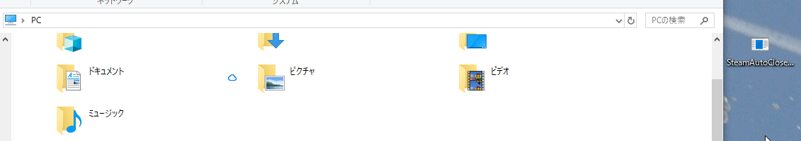

# SteamAutoClose

[Click here for English README](https://github.com/book000/SteamAutoClose/blob/master/README.md)

Steamの画面を自動で閉じます。

## 使い方

1. [Releases](https://github.com/book000/SteamAutoClose/releases)からSteamAutoClose.exeをダウンロードします。
2. `%APPDATA%\Microsoft\Windows\Start Menu\Programs\Startup`にアクセスし、ダウンロードしたSteamAutoClose.exeをコピー・ペーストします。
3. おわり。

## 機能解説

起動後に最初に起動してくるSteamのアプリケーションのメイン画面をクローズさせます。  
アプリケーションの起動から3分以内にSteamが起動してこない場合は当アプリケーション自体を終了します。

## ライセンス

当アプリケーションには[MIT License](https://github.com/book000/SteamAutoClose/blob/master/LICENSE)を適用します。

## 免責事項

作者(Tomachi)は、当アプリケーションを利用したことによる如何なる問題に対して責任を負いません。